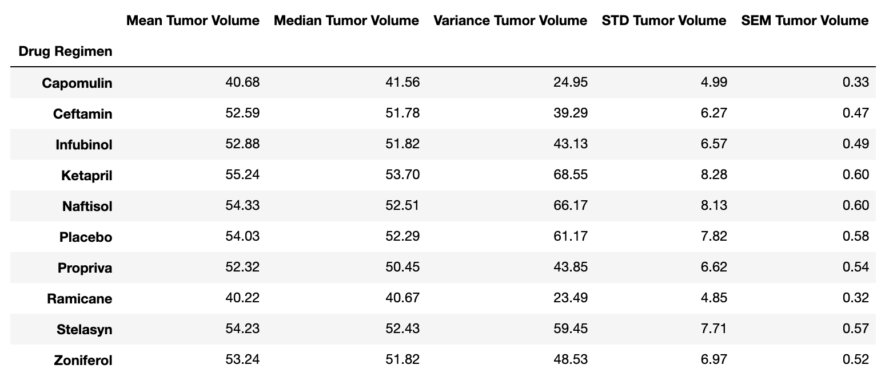
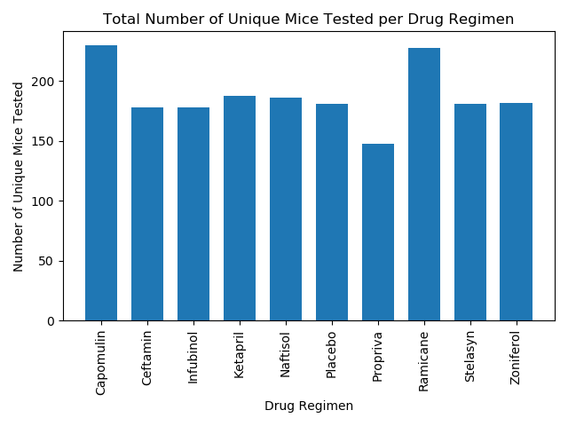
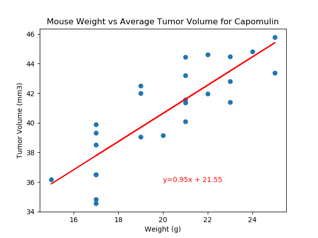

### Matplotlib_Challenge
GT Data Bootcamp - Matplotlib HW_Rios

### Pymaceuticals Inc.: Summary of the most recent animal study treated with a variety of drug regimens. 

Study Overview: In this study, 249 mice identified with SCC tumor growth were treated through a variety of drug regimens. Over the course of 45 days, tumor development was observed and measured. The purpose of this study was to compare the performance of Pymaceuticals' drug of interest, Capomulin, versus the other treatment regimens. 

This summary shows technical tables and figures needed for the technical report of the overall study and overall trends.

### Technical Summary

* Data for any mouse ID with duplicate time points was remove any data associated with that mouse ID.  There was one mouse ID removed due to duplicate time points: Mouse ID g989.  Total of 248 mice were used for data analysis.

* Table 1: Summary statistics table consisting of the mean, median, variance, standard deviation, and SEM of the tumor volume for each drug regimen.

* Figure 1 shows the number of total mice for each treatment regimen throughout the course of the study.

* Figure 2 shows the total percentage of male versus female mice

* Figure 3 shows the final tumor volume of each mouse across four of the most promising treatment regimens: Capomulin, Ramicane, Infubinol, and Ceftamin and the quartiles and IQR, to quantitatively determine if there are any potential outliers across all four treatment regimens.

* Figure 4 shows a box and whisker plot of the final tumor volume for all four treatment regimens and highlights any potential outliers in the plot with a star.

* Figure 5 shows the tumor volume versus time point for one mouse that was treated with Capomulin.

* Figure 6 shows a scatter plot of mouse weight versus average tumor volume for the Capomulin treatment regimen.  With the correlation coefficient and linear regression model between mouse weight and average tumor volume for the Capomulin treatment and the linear regression model.

 
